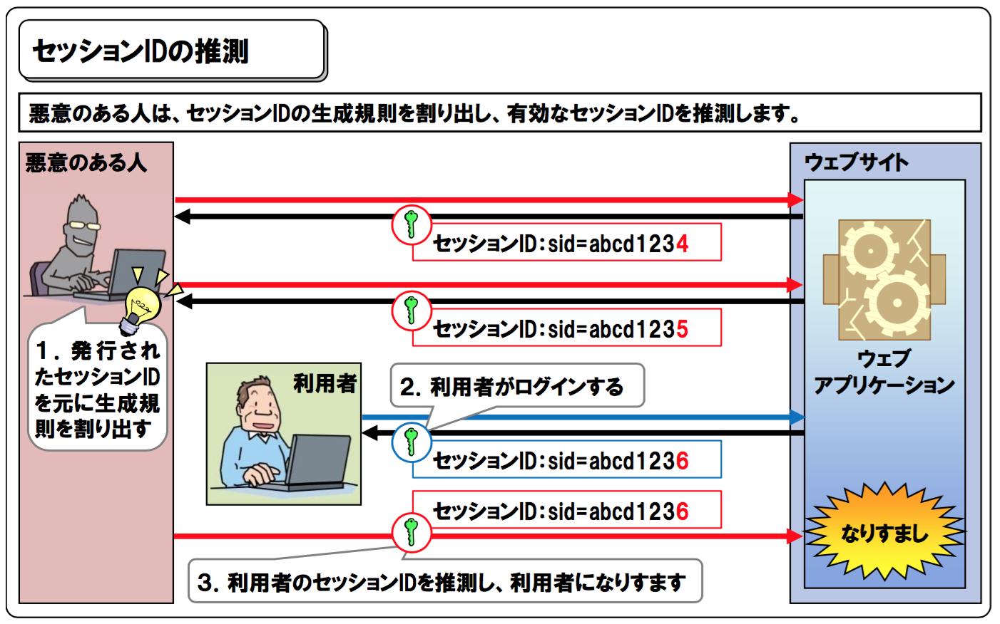
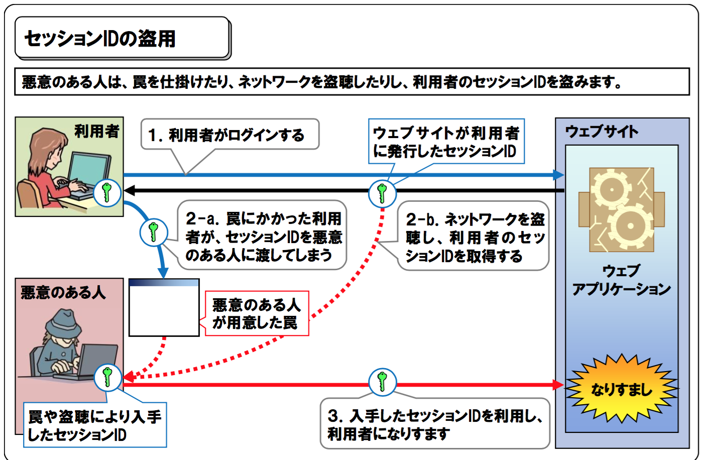
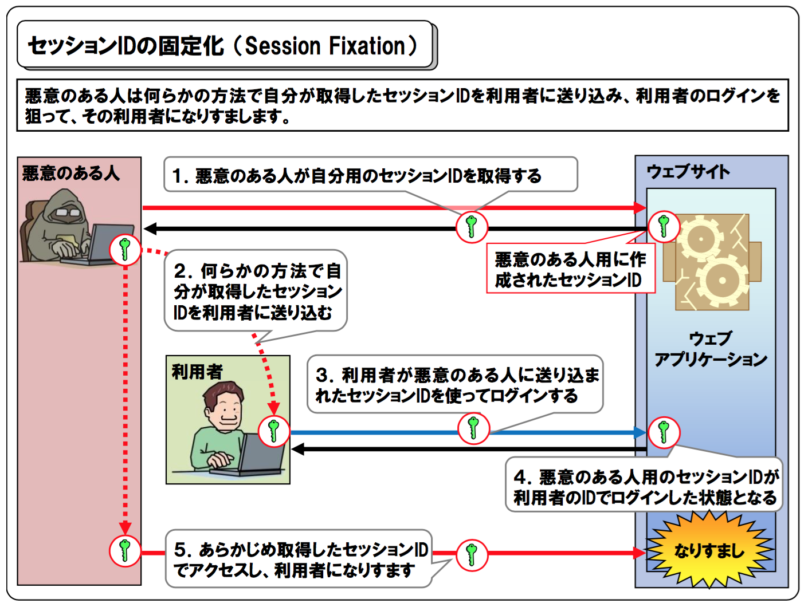

# アプリケーション開発セキュリティガイドライン

<!-- START doctoc generated TOC please keep comment here to allow auto update -->
<!-- DON'T EDIT THIS SECTION, INSTEAD RE-RUN doctoc TO UPDATE -->


- [はじめに](#%E3%81%AF%E3%81%98%E3%82%81%E3%81%AB)
- [1 ガイドラインの基本的な考え方](#1-%E3%82%AC%E3%82%A4%E3%83%89%E3%83%A9%E3%82%A4%E3%83%B3%E3%81%AE%E5%9F%BA%E6%9C%AC%E7%9A%84%E3%81%AA%E8%80%83%E3%81%88%E6%96%B9)
  - [1.1 目的](#11-%E7%9B%AE%E7%9A%84)
  - [1.2 適用範囲](#12-%E9%81%A9%E7%94%A8%E7%AF%84%E5%9B%B2)
- [2. 入力検証及び不正入力時の無効化](#2-%E5%85%A5%E5%8A%9B%E6%A4%9C%E8%A8%BC%E5%8F%8A%E3%81%B3%E4%B8%8D%E6%AD%A3%E5%85%A5%E5%8A%9B%E6%99%82%E3%81%AE%E7%84%A1%E5%8A%B9%E5%8C%96)
  - [2.1. インジェクション](#21-%E3%82%A4%E3%83%B3%E3%82%B7%E3%82%99%E3%82%A7%E3%82%AF%E3%82%B7%E3%83%A7%E3%83%B3)
    - [2.1.1. SQLインジェクション](#211-sql%E3%82%A4%E3%83%B3%E3%82%B7%E3%82%99%E3%82%A7%E3%82%AF%E3%82%B7%E3%83%A7%E3%83%B3)
      - [脆弱性概要](#%E8%84%86%E5%BC%B1%E6%80%A7%E6%A6%82%E8%A6%81)
      - [例](#%E4%BE%8B)
      - [対策](#%E5%AF%BE%E7%AD%96)
    - [2.1.2. OSコマンドインジェクションの防御](#212-os%E3%82%B3%E3%83%9E%E3%83%B3%E3%83%88%E3%82%99%E3%82%A4%E3%83%B3%E3%82%B7%E3%82%99%E3%82%A7%E3%82%AF%E3%82%B7%E3%83%A7%E3%83%B3%E3%81%AE%E9%98%B2%E5%BE%A1)
      - [例](#%E4%BE%8B-1)
      - [対策](#%E5%AF%BE%E7%AD%96-1)
    - [2.1.3. ディレクトリトラバーサル](#213-%E3%83%87%E3%82%A3%E3%83%AC%E3%82%AF%E3%83%88%E3%83%AA%E3%83%88%E3%83%A9%E3%83%90%E3%83%BC%E3%82%B5%E3%83%AB)
      - [例](#%E4%BE%8B-2)
      - [対策](#%E5%AF%BE%E7%AD%96-2)
    - [2.1.4. HTTPレスポンス分割の防御](#214-http%E3%83%AC%E3%82%B9%E3%83%9D%E3%83%B3%E3%82%B9%E5%88%86%E5%89%B2%E3%81%AE%E9%98%B2%E5%BE%A1)
      - [例](#%E4%BE%8B-3)
      - [対策](#%E5%AF%BE%E7%AD%96-3)
    - [2.1.5. メールヘッダインジェクションの防御](#215-%E3%83%A1%E3%83%BC%E3%83%AB%E3%83%98%E3%83%83%E3%83%80%E3%82%A4%E3%83%B3%E3%82%B8%E3%82%A7%E3%82%AF%E3%82%B7%E3%83%A7%E3%83%B3%E3%81%AE%E9%98%B2%E5%BE%A1)
      - [例](#%E4%BE%8B-4)
      - [対策](#%E5%AF%BE%E7%AD%96-4)
    - [2.1.6. 不正ファイルアップロードの防御](#216-%E4%B8%8D%E6%AD%A3%E3%83%95%E3%82%A1%E3%82%A4%E3%83%AB%E3%82%A2%E3%83%83%E3%83%97%E3%83%AD%E3%83%BC%E3%83%89%E3%81%AE%E9%98%B2%E5%BE%A1)
      - [例](#%E4%BE%8B-5)
      - [対策](#%E5%AF%BE%E7%AD%96-5)
  - [2.2. クロスサイトスクリプト(XSS)](#22-%E3%82%AF%E3%83%AD%E3%82%B9%E3%82%B5%E3%82%A4%E3%83%88%E3%82%B9%E3%82%AF%E3%83%AA%E3%83%97%E3%83%88xss)
- [3. セッション管理と認証の不備](#3-%E3%82%BB%E3%83%83%E3%82%B7%E3%83%A7%E3%83%B3%E7%AE%A1%E7%90%86%E3%81%A8%E8%AA%8D%E8%A8%BC%E3%81%AE%E4%B8%8D%E5%82%99)
  - [3.1. セッションハイジャック](#31-%E3%82%BB%E3%83%83%E3%82%B7%E3%83%A7%E3%83%B3%E3%83%8F%E3%82%A4%E3%82%B7%E3%82%99%E3%83%A3%E3%83%83%E3%82%AF)
    - [例](#%E4%BE%8B-6)
    - [対策](#%E5%AF%BE%E7%AD%96-6)
- [4. クロスサイトフォージェリー(CSRF)](#4-%E3%82%AF%E3%83%AD%E3%82%B9%E3%82%B5%E3%82%A4%E3%83%88%E3%83%95%E3%82%A9%E3%83%BC%E3%82%B8%E3%82%A7%E3%83%AA%E3%83%BCcsrf)
- [5. ファイルやディレクトリ、設定情報等のリソースへの直接参照](#5-%E3%83%95%E3%82%A1%E3%82%A4%E3%83%AB%E3%82%84%E3%83%87%E3%82%A3%E3%83%AC%E3%82%AF%E3%83%88%E3%83%AA%E8%A8%AD%E5%AE%9A%E6%83%85%E5%A0%B1%E7%AD%89%E3%81%AE%E3%83%AA%E3%82%BD%E3%83%BC%E3%82%B9%E3%81%B8%E3%81%AE%E7%9B%B4%E6%8E%A5%E5%8F%82%E7%85%A7)
- [6. セキュリティ設定のミス](#6-%E3%82%BB%E3%82%AD%E3%83%A5%E3%83%AA%E3%83%86%E3%82%A3%E8%A8%AD%E5%AE%9A%E3%81%AE%E3%83%9F%E3%82%B9)
- [7. 機密データの露出](#7-%E6%A9%9F%E5%AF%86%E3%83%86%E3%82%99%E3%83%BC%E3%82%BF%E3%81%AE%E9%9C%B2%E5%87%BA)
  - [7.1. 脆弱性概要](#71-%E8%84%86%E5%BC%B1%E6%80%A7%E6%A6%82%E8%A6%81)
  - [7.2. 対策](#72-%E5%AF%BE%E7%AD%96)
    - [7.2.1. サイトのSSL化](#721-%E3%82%B5%E3%82%A4%E3%83%88%E3%81%AEssl%E5%8C%96)
    - [7.2.2. 機密データの暗号化](#722-%E6%A9%9F%E5%AF%86%E3%83%87%E3%83%BC%E3%82%BF%E3%81%AE%E6%9A%97%E5%8F%B7%E5%8C%96)
      - [7.2.2.1 暗号化が必要なケース](#7221-%E6%9A%97%E5%8F%B7%E5%8C%96%E3%81%8C%E5%BF%85%E8%A6%81%E3%81%AA%E3%82%B1%E3%83%BC%E3%82%B9)
      - [7.2.2.2. 推奨アルゴリズム](#7222-%E6%8E%A8%E5%A5%A8%E3%82%A2%E3%83%AB%E3%82%B4%E3%83%AA%E3%82%BA%E3%83%A0)
  - [7.2.3. 公開ディレクトリへの配置](#723-%E5%85%AC%E9%96%8B%E3%83%87%E3%82%A3%E3%83%AC%E3%82%AF%E3%83%88%E3%83%AA%E3%81%B8%E3%81%AE%E9%85%8D%E7%BD%AE)
  - [7.2.4. 通信時のデータ保護](#724-%E9%80%9A%E4%BF%A1%E6%99%82%E3%81%AE%E3%83%87%E3%83%BC%E3%82%BF%E4%BF%9D%E8%AD%B7)
- [8. 機能レベルアクセス制御の欠落](#8-%E6%A9%9F%E8%83%BD%E3%83%AC%E3%83%98%E3%82%99%E3%83%AB%E3%82%A2%E3%82%AF%E3%82%BB%E3%82%B9%E5%88%B6%E5%BE%A1%E3%81%AE%E6%AC%A0%E8%90%BD)
  - [8.1. 脆弱性概要](#81-%E8%84%86%E5%BC%B1%E6%80%A7%E6%A6%82%E8%A6%81)
- [8.2. 対策](#82-%E5%AF%BE%E7%AD%96)
  - [8.2.1. 機能分離とユーザー権限](#821-%E6%A9%9F%E8%83%BD%E5%88%86%E9%9B%A2%E3%81%A8%E3%83%A6%E3%83%BC%E3%82%B6%E3%83%BC%E6%A8%A9%E9%99%90)
  - [8.2.2. 暗黙的拒否](#822-%E6%9A%97%E9%BB%99%E7%9A%84%E6%8B%92%E5%90%A6)
- [9. 既知の脆弱性を持つコンポーネントの使用](#9-%E6%97%A2%E7%9F%A5%E3%81%AE%E8%84%86%E5%BC%B1%E6%80%A7%E3%82%92%E6%8C%81%E3%81%A4%E3%82%B3%E3%83%B3%E3%83%9B%E3%82%9A%E3%83%BC%E3%83%8D%E3%83%B3%E3%83%88%E3%81%AE%E4%BD%BF%E7%94%A8)
  - [9.1. 脆弱性概要](#91-%E8%84%86%E5%BC%B1%E6%80%A7%E6%A6%82%E8%A6%81)
  - [9.2. 対策](#92-%E5%AF%BE%E7%AD%96)
    - [9.2.1. 情報収集](#921-%E6%83%85%E5%A0%B1%E5%8F%8E%E9%9B%86)
    - [9.2.2. 利用技術の精査と限定化](#922-%E5%88%A9%E7%94%A8%E6%8A%80%E8%A1%93%E3%81%AE%E7%B2%BE%E6%9F%BB%E3%81%A8%E9%99%90%E5%AE%9A%E5%8C%96)
    - [9.2.3. 最新バージョンの利用](#923-%E6%9C%80%E6%96%B0%E3%83%90%E3%83%BC%E3%82%B8%E3%83%A7%E3%83%B3%E3%81%AE%E5%88%A9%E7%94%A8)
    - [9.2.4. テスト自動化の推進](#924-%E3%83%86%E3%82%B9%E3%83%88%E8%87%AA%E5%8B%95%E5%8C%96%E3%81%AE%E6%8E%A8%E9%80%B2)
- [10. 未検証のリダイレクトとフォワード](#10-%E6%9C%AA%E6%A4%9C%E8%A8%BC%E3%81%AE%E3%83%AA%E3%82%BF%E3%82%99%E3%82%A4%E3%83%AC%E3%82%AF%E3%83%88%E3%81%A8%E3%83%95%E3%82%A9%E3%83%AF%E3%83%BC%E3%83%88%E3%82%99)
  - [10.1. 脆弱性概要](#101-%E8%84%86%E5%BC%B1%E6%80%A7%E6%A6%82%E8%A6%81)
- [10.2. 対策](#102-%E5%AF%BE%E7%AD%96)

<!-- END doctoc generated TOC please keep comment here to allow auto update -->

## はじめに
このガイドラインでは、medibaにおける、アプリケーション開発におけるセキュリティ対策についてのガイドラインを下記の大項目に分け、それぞれ定めます。

## 1 ガイドラインの基本的な考え方

### 1.1 目的

脆弱性を正しく理解し、対策を立てることで、お客様情報、コンテンツ情報を保護し、システムの不正利用を防止することで事業運営の健全化を図る。
このガイドラインはOWASP TOP10、KDDIセキュリティガイドラインを基にした内容となっております。

### 1.2 適用範囲

システム開発に関与する業務に適用する。


## 2. 入力検証及び不正入力時の無効化

悪意のあるユーザが不正な文字列を組み込むことで、本来アクセス権限のないデータを入手、改竄、破壊などユーザからの入力を出力画面に含む前に、適切なエスケープや入力検証での確認をしない場合、脆弱になります。

### 2.1. インジェクション

SQLとOS、LDAPなどのインジェクション脆弱性は、信頼されていないデータがコマンド又はクエリの一部として、サーバーに送信される際に発生します。  
攻撃者の悪意のあるデータは、意図しないコマンドの実行や適切な権限のないデータアクセス実行するようにインタプリタを騙し、webサイト内容を改竄される可能性が発生します。  
改竄された場合、被害（社会的信用の低下、事業活動のストップなど）に遭うだけでなく、medibaが加害者になってしまう可能性もあるため、深刻な事態であることを認識して下さい。

#### 2.1.1. SQLインジェクション

##### 脆弱性概要

データベースに渡され実行が行われる文字列に有害なコードを挿入する攻撃手法、またはその脆弱性の事を呼びます。
Webコンテンツ(Webサーバー)から接続しているデータベースに、管理者・開発者の意図しないSQL文を処理させる事でデータベースから情報の抜き取り、コンテンツの改竄やユーザー情報の漏洩を引き起こします。  
主にはパラメータで渡される文字列に対して、エスケープ処理を行わないままSQL文に連結しデータベースへアクセスする事で引き起こされます。


##### 例

**脆弱性のあるコード例(PHP × MySQL)**
```
$dbh = new PDO('mysql:host=127.0.0.1;dbname=test', 'username', 'password');

$userId = $_POST['userId'];
$password = $_POST['password'];
// ユーザー入力情報を利用して SQL文を作成
$sql = "SELECT * FROM ユーザマスタ WHERE ユーザID = '{$userId}' AND パスワード = '{$password}'";

$sth = $dbh->query($sql);
// ...
```

**引き起こされる例**  
入力値が以下の場合
>$userId →
「 (何も入力しない) 」  
$password →
「'; DELETE FROM ユーザマスタ WHERE 'A' = 'A」

**実行されるSQL**  
1. SELECT * FROM ユーザマスタ WHERE ユーザID = '' AND パスワード = '';  
1. DELETE FROM ユーザマスタ WHERE 'A' = 'A'

##### 対策

SQL文の組み立てにバインド機構(プレースホルダ)を使用する事により、入力データは数値定数や文字列定数として組み込まれるため、特殊文字は強制的にただのパラメータ文字として認識され、SQL文が改変される危険性がなくなります。 また、入力前にコンパイルされているので、SQLインジェクションによってSQL文を変更することが不可能になります。

**プレースホルダを利用したコード例(PHP × MySQL)**

```
// プリペアドステートメントのエミュレーションを無効する
$dbh->setAttribute(PDO::ATTR_EMULATE_PREPARES, false);

// MySQL ネイティブの静的プレースホルダを使用する
$sql = "SELECT * FROM ユーザマスタ WHERE ユーザID = ? AND パスワード = ?";
$sth = $dbh->prepare($sql); // プリペアドステートメントを準備
// ...
```

#### 2.1.2. OSコマンドインジェクションの防御

SQLインジェクションのOSコマント版とも言える脆弱性です。
webサイトが閲覧者からのデータの入力受け付け、かつその情報をパラメータとしてOSをに対する命令文を実行する挙動を取っていた場合、プログラムに与えるパラメータにOSに対する命令文を紛れ込ませて不正に操作する攻撃を指します。  

##### 例

**脆弱性の原因となる関数例(PHP)**

``
exec(), passthru(), proc_open(), shell_exec(), system()
``

##### 対策  

1. アプリケーションを設計する際に、OSコマンドを呼び出す事を避けた設計にする。  
内部でOSコマンドを実施する事はリスクがある事を認識し、ライブラリ等を利用して解決する手法を模索して下さい。
1. サニタイジングを実施する。  
どうしてもOSコマンドを使用する必要となった場合は、ユーザーからの入力をエスケープする事は必須です。  
特に特殊文字はエスケープする。  
bashの場合、以下の特殊記号は別のコマンドの実行に繋がる可能性が高いため、特に注意して下さい。  
``
「;」「|」「&」「`」「(」「)」「$」「<」「>」「*」「?」「{」「}」「[」「]」「!」
``

#### 2.1.3. ディレクトリトラバーサル

webサイトがサーバ内のファイルを表示する際に、管理者が意図していないパスが指定されることによって、想定外のファイルが閲覧できてしまう状態を突いた攻撃手法を指します。  
ファイル名としてユーザーが任意に変更する事ができる値( GET/POSTパラメータやcookie値など )を利用する箇所で発生する可能性があります。


##### 例
**脆弱性のあるコード例(PHP)**  
- 日本語/英語/中国語の３ヶ国語に対応したwebサイト
    - 全てのページは３ヶ国語のテンプレート(JAPANESE.html, ENGLISH.html, FRANCH.html )が予め準備されている。
    - 選択された言語のテンプレートファイル名をcookie["TEMPLATE"]に保持する。
    - コンテンツ内では選択された言語のテンプレートファイルを表示する。

```
<?php
$template = 'JAPANESE.html';
if ( is_set( $_COOKIE['TEMPLATE'] ) )
   $template = $_COOKIE['TEMPLATE'];
include ( "/var/www/templates/" . $template );
?>
```

**このシステムに対する攻撃例**  
```
GET /xxx.php HTTP/1.0
Cookie: TEMPLATE=../../../../../../../../../etc/passwd
```

**生成されるサーバのレスポンス**
```
HTTP/1.0 200 OK
Content-Type: text/html
Server: Apache

// 以下 /etc/passwd が応答結果に出力される
root:x:0:0:root:/root:/bin/bash
bin:x:1:1:bin:/bin:/sbin/nologin
daemon:x:2:2:daemon:/sbin:/sbin/nologin
// …
```

##### 対策
1. 外部からファイル名を要求する仕様にしない。
1. 避けられない場合は、パラメータからディレクトリ名を取り除きファイル名のみを抽出する仕様にする。
1. ファイルをincludeする際は、許可してないディレクトリにアクセスしてないか、プログラム内でチェックする。
1. アクセス権限は公開用と非公開で分け、公開ディレクトリ以外は必要なユーザのみアクセス権を付与する。

#### 2.1.4. HTTPレスポンス分割の防御

外部からの入力データを使用して動的にHTTPレスポンスヘッダーを出力するwebアプリケーションの脆弱性を利用し、正規のHTTPレスポンスを「CR+LF」で分割することにより悪意のHTTPレスポンスを生成する攻撃手法を指します。  
直接的には脆弱性のあるページが影響を受けますが、悪意のHTTPレスポンスがProxyにキャッシュされる事により、他ユーザが悪意のHTTPレスポンスを取得することになり、ページの偽装/XSS/Cookieの操作 などの攻撃が可能になります。


##### 例
- ユーザーが入力した番号のページへリダイレクトする仕様のwebサイト
    - HTTPレスポンスヘッダーの「Location:」フィールドの値として、出力するURLのGETパラメータを入力フォームから受け付ける

**正常なHTTPレスポンスヘッダー(入力フォームから「1」を受け付けた場合)**
```
HTTP/1.1 302 Moved
Temporarily
Content-Type: text/html
Location: http://sample.com/page.php?id=1
```

**攻撃例：「1」の代わりに以下の内容を入力パラメータとして送信する**  
```
1%0d%0aContent-Length:%200%0d%0a%0d%0aHTTP/1.1%20%200%20OK%0d%0aContent-Type:%20text/html%0d%0aContent-Length:%209999%0d%0a%0d%0a<html>悪意のあるコンテンツ</html>
```

**生成されるレスポンス**
```
HTTP/1.1 302 Moved
Temporarily
Content-Type: text/html
Location: http://sample.com/page.php?id=1
Content-Length:0

HTTP/1.1 200 OK
Content-Type: text/html
Content-Length:9999

<html>悪意のあるコンテンツ</html>
```
HTTPの仕様では、改行コード(「CR+LF」(%0d%0a))2つによってヘッダーの終了を表します。  
上の例では｢Content-Length:0｣の後で1つのレスポンスが終了し、｢HTTP/1.1 200 OK｣以降は別のレスポンスと解釈されます。  
2番目のレスポンスの内容は、完全に攻撃者の自由となってしまいます。

##### 対策

1. HTTPヘッダとして出力する箇所には「CR/LF」(%0d%0a)」を入れない。
1. ユーザー入力文字列をHTTPレスポンスヘッダー挿入する際には、同じく「CR/LF」(%0d%0a)」を削除する。

#### 2.1.5. メールヘッダインジェクションの防御

宛先（To）や件名（Subject）などのメールヘッダを外部から指定する際に、改行文字を使ってメールヘッダや本文を追加・変更する攻撃手法を指します。  
webサイト自体は直接影響を受けるページはありませんが、送信するメールについて、件名や送信元/本文が改変されたり、また迷惑メールやウイルスメールの送信に悪用されることになります。


##### 例
PHPのメール送信関数 mail / mb_send_mail は同じシグネイチャを持っています。  
``
bool mail ( string $to , string $subject , string $message [, string $additional_headers [,string $additional_parameters ]] )
``  
この第４引数 $additional_parameters(追加メールヘッダ)は、改行区切りでFrom/Cc/Bccを順に指定する仕様となっているため、ユーザーからの入力値を直接設定すると、管理者の意図しないCc,Bccが設定される可能性が発生します。

##### 対策
1. ユーザーからの入力データはバリデーションしておき、改行を除く。
1. PHP 7.2からは$additional_headerは配列で指定することが可能になったため、文字列ではなく配列を利用する。

#### 2.1.6. 不正ファイルアップロードの防御

閲覧者からのファイルアップロードを受け付ける場合、アップロードされたファイルを利用して不正な操作をする攻撃を指します。  
アップロードされたファイルに対してはファイル名、保存場所、ファイル内容等に対しチェックを実施しましょう。

##### 例
**脆弱性のあるコード例(PHP)**  
```
<?php
//ファイルをアップロードして、公開フォルダ「images」直下にそのままのファイル名で置く。
if (!empty($_FILES['uploadfile']['tmp_name']）) {
    move_uploaded_file($_FILES['uploadfile']['tmp_name'], dirname(__FILE__).'/images/'.$_FILES['uploadfile']['name']);
    header('Location:http://'.$_SERVER['HTTP_HOST'].$_SERVER['SCRIPT_NAME']);
    exit;
}
header("Content-Type: test/html; charset=Shift_JIS");
echo "
<html><body>
<form action='' method='post' enctype='multipart/form-data'>
    <input type='file' name='uploadfile' />
    <input type='submit' value='upload' />
</form>
</body></html>
";
```

- ファイルに対する入力チェックを行っていなため、画像以外のファイルを公開フォルダにアップロードされてしまいます。
- 悪意のあるスクリプトがwebサイト上に公開される可能性があります。

##### 対策
1. アップロードファイルの保存先は公開フォルダは使用しない。  
公開フォルダの外が利用できない場合には、ファイル名を拡張子のないランダムなものに変更して保存し、アップロードファイルへのアクセスについては、別途機能を用意する。
1. 拡張子名に対してバリデーションをかけ、所定の拡張子以外はエラーとする。  
また、拡張子とファイルの中身が一致しているかを確認すること。(PHPの場合、getimagesize()関数など)

### 2.2. クロスサイトスクリプト(XSS)

XSS欠陥は、アプリケーションが信頼されていないデータを受け取る時、適切な検証やエスケープをせずに、 ウェブブラウザに送信する際に発生します。XSSにより、攻撃者は被害者のブラウザでスクリプトを実行でき、ユーザセッションのハイジャックやウェブサイトの改竄、またユーザを悪意のあるサイトにリダイレクトすることが可能です。

## 3. セッション管理と認証の不備

認証とセッション管理に関連するアプリケーション機能は、しばしば正しく実装されていません。そのため、 攻撃者はパスワード又は鍵、セッショントークンを漏洩させたり、他の実装の不備を悪用してなりすますことができます。

### 3.1. セッションハイジャック

ログイン状態などをセッションにて保持する場合、クライアント側ではcookieにセッションIDを保存しますが、このセッションIDを他のユーザーのものに書き換える攻撃を指します。  
セッションIDを書き換える事により、なりすまし、権限の不正取得などができるようになります。

#### 例

* セッションIDの推測  
攻撃者は、セッションIDの生成規則を割り出し、有効なセッションIDを推測します。  



* セッションIDの盗用
攻撃者は、罠を仕掛けたり、ネットワークを盗聴したりし、利用者のセッションIDを盗みます。



* セッションIDの固定化
攻撃者は、自分が取得したセッションIDを善意の利用者のセッションIDに送り込みます。



#### 対策

なりすましや管理者権限の不正取得などができないよう、適切な措置を講ずること。

* セッションIDは、生成アルゴリズムに安全な擬似乱数生成系を用いるなどして、予測困難なものにする
* セッションIDをURLパラメータに格納しない
* HTTPSでCookieにsecure属性を加える
* ログイン成功後に、新しくセッションを開始するようする


## 4. クロスサイトフォージェリー(CSRF)

CSRF攻撃は、脆弱性のあるWebアプリケーションに対し、ログオンしている被害者のブラウザから、偽造されたHTTPリクエストを送信させます。そのリクエストには、被害者のセッションクッキーや他の自動的に組み込まれた認証情報が含まれています。これにより、攻撃者は脆弱性のあるアプリケーションに、ユーザからの正当なリクエストとして認識されるリクエストを被害者のブラウザに生成させることができます。

## 5. ファイルやディレクトリ、設定情報等のリソースへの直接参照

開発者がファイル又はディレクトリ、データベースのキーなど、内部に実装されていて、かつ権限が適切に設定されていないリソースへの参照を公開する際に発生する脆弱性です。
アクセス制御チェックや他の保護が無ければ、攻撃者はこれらの参照を用い、アクセス権限のないデータへアクセスすることができます。

## 6. セキュリティ設定のミス

適切なセキュリティには、アプリケーション、フレームワーク、アプリケーションサーバ、Webサーバ、データベースサーバ、およびプラットフォームに対して、セキュアな設定を定義して反映させる事が必要です。製品のデフォルト設定は安全ではない場合が多いため、セキュアな設定が定義・実装・維持されないといけません。また、ソフトウェアを最新の状態に保つ必要があります。

## 7. 機密データの露出

### 7.1. 脆弱性概要

機密データを暗号化していないこと、また弱いアルゴリズムによるパスワードハッシュなどで発生する脆弱性となります。
攻撃者は通常暗号化を直接破ることはせず、サーバやユーザのブラウザから転送中の平文を盗みます。万一のデータ流出時にもデータ内容を解読、悪用されないよう対策を講じ、また、機密データの誤った公開や意図しないファイルの流出を抑止するための対策が必要となります。

### 7.2. 対策

#### 7.2.1. サイトのSSL化

ログインやお客様情報といった認証を必要とする画面は、SSLを使用すること

#### 7.2.2. 機密データの暗号化

機密データを盗聴や盗難から守り、万一のデータ流出時にもデータ内容を解読、悪用されないよう以下の対策を実施します。
尚、本項でいう暗号化は一方向ハッシュも含みます。

##### 7.2.2.1 暗号化が必要なケース

以下に該当する情報を保持する場合は暗号化をすること
* パスワード
* クレジットカード番号
* 個人情報に該当し、特に機微な情報（医療情報、金銭的資産）
* その他特に会社が暗号化が必要と認めたもの

##### 7.2.2.2. 推奨アルゴリズム

以下のケースでは推奨するアルゴリズムを適用すること
* 復号化が必要なケース
  * AES一択。ECB（ivが別のものでも良い）かCBC（全く同一のivが求められる）は、機密性に応じて選択すること
  * 複合用のパスワードの保管に十分に注意すること
    * ソースコードにはハードコーディングは絶対禁止
    * 環境変数または設定ファイルに個別に保管管理すること
* パスワード
  * bcrypt, pbkdf2, scryptのいずれかを用いること
    * システムのCPUリソースに余裕がある場合はpbkdf2, scryptを推奨
  * ストレッチングする場合は、最低10,000回ストレッチすること
* パスワード以外で一方向ハッシュしたいケース
  * sha2(sha256, sha512) 以上
  * saltはユニークなもので十分な長さのものを用意すること

### 7.2.3. 公開ディレクトリへの配置

ログファイル、バックアップファイル、設定ファイルなど公開を前提としたファイルは、公開ディレクトリ上に配置しないようにする。また、HTTPサーバーのディレクトリスティングは無効にして下さい。

### 7.2.4. 通信時のデータ保護

機密情報をクエリストリングに含めない。また、重要情報のURLは規則性を持たせず不規則な英数字や記号を交えた長い文字列にすることで推測しにくいようにして下さい。

クエリストリングに機微な情報が含まれる場合、以下の潜在リスクが考えられます。
* httpサーバのログに残る
* ブラウザのキャッシュに残ったり、Google等の検索履歴に引っかかってくるおそれがある

また、公開される情報がキー値を元に生成される場合は、UUIDモジュールなどを用いたキーの生成をして下さい。

* 例) IDをキーにURLを生成していてそのURLが本来推測して欲しくない

## 8. 機能レベルアクセス制御の欠落

### 8.1. 脆弱性概要

ネットワークアクセス可能なシステムであれば誰でもリクエスト送信出来るため、適切な権限設定がされていない場合、URLやパラメータを改変し、本来保護されるべき機能やデータへアクセスされます。


## 8.2. 対策

### 8.2.1. 機能分離とユーザー権限

* 提供先に応じたネットワークレベルの公開設定を適切に行なうこと
* 一人一ユーザーとして、権限を明確に設定すること

### 8.2.2. 暗黙的拒否

* デフォルトはアクセス拒否し、ユーザーに対して必要な権限設定を付与する運用にすること

## 9. 既知の脆弱性を持つコンポーネントの使用

### 9.1. 脆弱性概要

ライブラリ、フレームワーク、および他のソフトウェアモジュールなどのコンポーネントは、ほとんど常にフル権限で実行されます。脆弱なコンポーネントが悪用される場合、深刻なデータ損失やサーバ乗っ取りまでに至る攻撃ができます。既知の脆弱性を持つコンポーネントを使用するアプリケーションは、アプリケー ションの防御を弱体化し、様々な攻撃と影響も可能になります。

### 9.2. 対策

#### 9.2.1. 情報収集

下記から定期的に情報収集を行ない、深刻な脆弱性を早期発見して下さい
* [JVN](http://jvndb.jvn.jp/index.html)などの公的機関
* 品質管理経由で周知されるKDDI脆弱性情報
* 利用しているOSSのアップデートやIssue

#### 9.2.2. 利用技術の精査と限定化

* 不要のパッケージは使用せずに削除すること
* OSSの利用には信頼性を確認すること

#### 9.2.3. 最新バージョンの利用

* 初期構築時にOS、ライブラリなどバージョンを最新にすること
* 運用フェーズにおいて定期的にバージョンアップにすること

#### 9.2.4. テスト自動化の推進

深刻な脆弱性が発覚しても影響範囲を確認が必要なため即アップデートは出来ません。  
アップデートを迅速に行なうため下記の環境を用意する。
* 機能に対してテストコードを用意し機械的にテストが実行出来ること
* CI(継続的インテグレーション)環境を導入し自動的に不具合検知が出来ること

## 10. 未検証のリダイレクトとフォワード

### 10.1. 脆弱性概要

Webアプリケーションは、頻繁にユーザを他の画面やウェブサイトへリダイレクト・フォーワードしますが、信頼されていないデータを用いて、転送先画面を決定しています。適切な検証がないと、攻撃者は被害者を フィッシングサイトやマルウェアサイトへリダイレクトできたり、フォーワードで閲覧権限のない画面へアクセスできます。


※過去、medibaで未検証のリダイレクトを許容するリダイレクトサーバーの脆弱性がありました

## 10.2. 対策

* 単なるリダイレクトやフォワードの使用は行わない
* 遷移先をホワイトリスト化、もしくはルール化しチェックする
